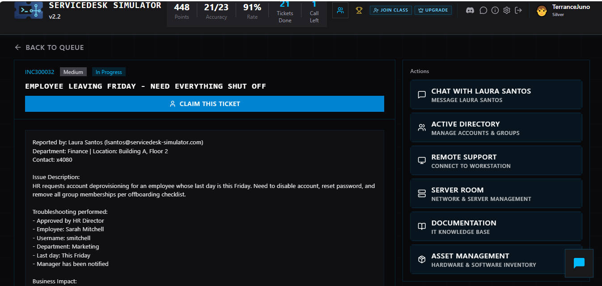
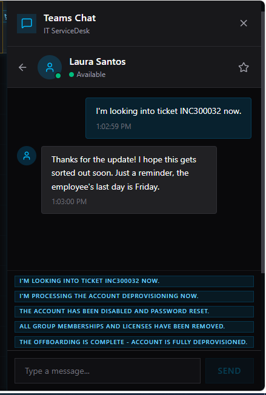
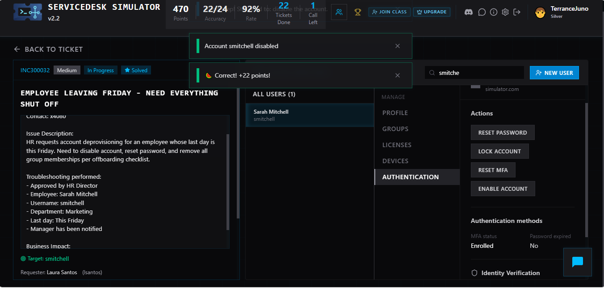

# Service Desk Simulator – Employee Offboarding Lab

## 📌 Overview
This project demonstrates a simulated IT service desk ticket involving employee offboarding and account deprovisioning in an enterprise environment. The scenario required reviewing a ticket request, validating details, communicating with the requester, and securely disabling a user account.

## 🧰 Technologies & Tools Used
- Active Directory (User Account Management)
- Remote Desktop (simulated environment)
- Ticketing System Workflow
- IT Documentation / Knowledge Base
- Asset & Identity Management

## 🎯 Objective
To process an employee offboarding request by:
- Reviewing the ticket details
- Verifying HR approval and employee information
- Disabling the user account
- Removing access and group memberships
- Communicating updates to the requester

---

## 📝 Ticket Summary

**Ticket Title:** Employee Leaving Friday – Need Everything Shut Off  
**Priority:** Medium  
**Request Type:** Account Deprovisioning  

**Description:**
HR submitted a request to fully deprovision an employee account before their final working day. Tasks included:
- Disabling the account
- Resetting the password
- Removing group memberships and access permissions

---

## 🔍 Steps Taken

1. Reviewed ticket details and confirmed:
   - Employee name and username
   - Department and manager notification
   - HR approval

2. Communicated with the requester to confirm ticket progress

3. Located the user account in the system

4. Performed account deprovisioning:
   - Disabled the account
   - Reset password
   - Removed access and group memberships

5. Verified account status change

6. Updated the requester and completed the ticket

---

## 💬 Communication Example

- “I’m looking into ticket INC300032 now.”
- “I’m processing the account deprovisioning now.”
- “The account has been disabled and password reset.”
- “All group memberships and licenses have been removed.”
- “Offboarding is complete – account is fully deprovisioned.”

---

## ✅ Result

- Account successfully disabled  
- Access fully removed  
- Ticket resolved according to offboarding procedures  
- Achieved a correct solution within the simulation environment  

---

## 📸 Screenshots

[Resolved](TicketResolved.PNG)
### Ticket Details

---
## 🧠 Key Skills Demonstrated

- User account management
- IT ticket lifecycle handling
- Troubleshooting and verification
- Professional communication
- Identity and access management (IAM)
- Following standard operating procedures (SOPs)

---

## 🚀 Takeaway

This lab simulates a real-world help desk scenario involving employee offboarding, reinforcing critical IT support skills such as account management, ticket handling, and user communication in a structured environment.
